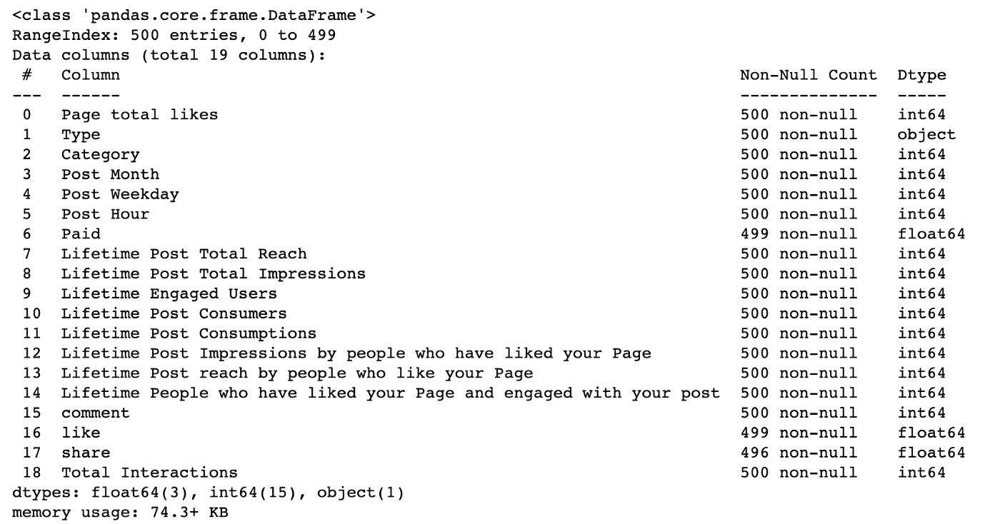
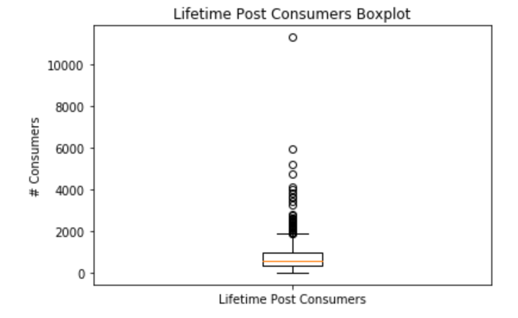
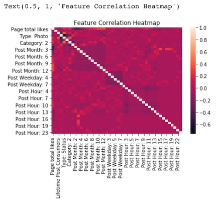
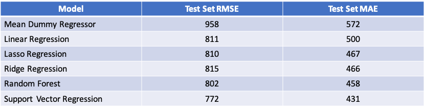

# Facebook Metrics Regression

## Introduction
My modeling goal was to build a model that could predict the number of unique viewers for a Facebook post based on features of that post.  I downloaded post data from the UCI Machine Learning Repository and read them into pandas, resulting in 500 datapoints.  I modeled the data using Linear Regression, Ridge Regression, Lasso Regression, Decision Tree Regression and Support Vector Regression.  The top performing model was Support Vector Regression with a Test Set RMSE of 772, which modestly outperformed the Mean Dummy Regressor Baseline Model Test Set RMSE of 958.

## Obtain Data
I downloaded marketing metric data for 500 Facebook posts from the UCI Machine Learning Repository in excel form and read the file into pandas.  

## Scrub Data

The Facebook dataset included 500 datapoints with 7 independent variables that could be used to predict 12 dependent variables. I decided to focus on modeling one of the dependent variables, ‘Lifetime Post Consumers’ and dropped the others. 6 of the 7 independent variables were categorical, so I created Dummy Variables for these features. The dataset included one missing value, which I replaced with the mean for that feature. The final scrubbed dataset had 45 features, 44 of which were dummy variables, across 500 datapoints.

## Explore Data

The model’s independent variable was quite disperse with a mean of 799 and a standard deviation of 883. A boxplot also revealed that the independent variable included dozens of upward outliers, however I decided not to remove any datapoints as the upper outlers seemed to be a natural part of the distribution of typical consumers for a post as opposed to anomalous values. All but one of my model features were dummy variables, so I did not find any non-linear relationships in my data.

My correlation heatmap revealed one pair of features, ‘Type: Photo” and “Type: Status” with a high correlation of -.75, however I decided to leave both features in to capture their modest non-correlated value. I also was curious how Ridge and Lasso might treat these correlated features.

## Model Data

I first ran a Mean Dummy Regressor, which had a Testing RMSE of 958 and Testing MAE of 572. I ran 5 additional models, Linear Regression, Ridge Regression, Lasso Regression, Decision Tree Regression and Support Vector Regression, all of which modestly outperformed the Mean Dummy Regressor in both Testing RMSE and Testing MAE.  Support Vector Regression was the top performing model with a Testing RMSE of 772 and MAE of 431.

## Analyze Results
After running all models, I did not find their performance to be particularly strong. SVR’s top performing MAE of 431 represented only a modest improvement on the Dummy Regressor performance of 572 and seemed high relative to the dataset mean of 799 and standard deviation of 883. I was curious if the high number of upward outliers in the dataset had affected model performance, so I decided to test removing the greatest outlier, which had a ‘Lifetime Post Consumers’ that was 12 standard deviations above the mean and almost double any other datapoint to see if my models were overfitting to this single datapoint. I tested the impact of removing this point by running a Mean Dummy Regressor (RMSE: 916, MAE: 525) and an SVR Model (RMSE: 779, MAE: 404). Any improvement in performance with this datapoint removed was modest, suggesting that outliers were not the main cause of modest model performance and instead that the independent variables just had modest ability to explain lifetime post consumption.

## Next steps
With more time, I would like to expand my modeling to predict some of the other 11 performance metrics beyond ‘Lifetime Post Consumers’ included in the original Facebook Metrics dataset.

# Github Files
[Modeling.ipynb](https://github.com/blantj/facebook_metrics_regression/blob/main/Modeling.ipynb) :  Facebook Metrics Regression Modeling

# Sources
UCI Machine Learning Repository: https://archive.ics.uci.edu/ml/datasets/Facebook+metrics
